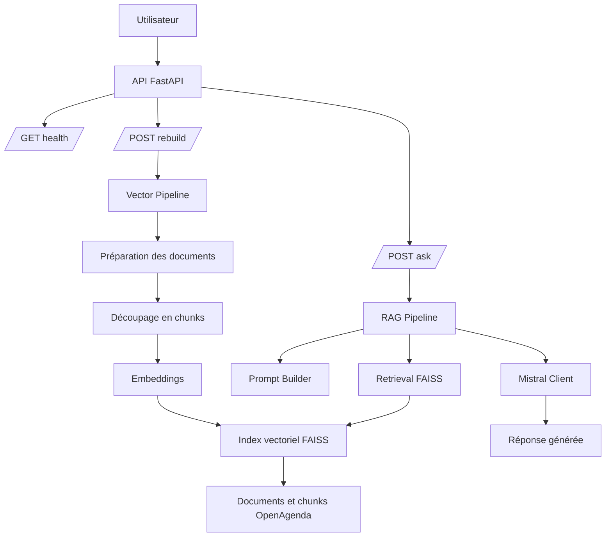

# Puls-Events — POC RAG


POC de système **Retrieval Augmented Generation (RAG)** permettant de répondre à des questions en langage naturel sur des événements culturels à partir des données OpenAgenda.

Le système combine :

- recherche vectorielle **FAISS**
- orchestration **LangChain**
- génération **Mistral**
- API **FastAPI**
- conteneurisation **Docker**

## Démo rapide

```bash
docker build -t puls-events-rag .
docker run --env-file .env -p 8000:8000 puls-events-rag
```


## Objectif

Réaliser un Proof of Concept (POC) d’un système **RAG (Retrieval Augmented Generation)** permettant de répondre à des questions sur des événements culturels.

Le système s’appuie sur :

- **OpenAgenda** pour la récupération des événements
- **LangChain** pour l’orchestration du pipeline RAG
- **FAISS** pour la recherche vectorielle
- **Mistral** pour la génération de réponses

---

## Structure du projet

```bash
puls-events-rag/

├── src/
│
│   ├── ingestion/
│   │   └── fetch_openagenda_events.py
│
│   ├── processing/
│   │   ├── normalize_openagenda_events.py
│   │   └── validate_dataset_quality.py
│
│   ├── embeddings/
│   │   ├── prepare_documents.py
│   │   ├── chunk_documents.py
│   │   ├── generate_embeddings.py
│   │   └── build_faiss_index.py
│
│   ├── retrieval/
│   │   └── semantic_search_demo.py
│
│   ├── pipelines/
│   │   ├── data_pipeline.py
│   │   ├── vector_pipeline.py
│   │   └── rag_demo_pipeline.py
│
│   ├── rag/
│   │   ├── prompt_builder.py
│   │   ├── mistral_client.py
│   │   └── rag_pipeline.py
│
│   ├── api/
│   │   ├── main.py
│   │   ├── schemas.py
│   │   └── manual_api_check.py
│
│   └── evaluation/
│       ├── qa_dataset.json
│       ├── evaluate_rag.py
│       ├── evaluation_results.json
│       ├── evaluate_rag_ragas.py
│       └── evaluation_results_ragas.json
│
├── tests/
│   ├── test_pipeline.py
│   ├── test_vector_pipeline.py
│   ├── test_rag_pipeline.py
│   ├── test_api.py
│   └── data/
│       └── sample_events.jsonl
│
├── docs/
│   ├── dataset_schema.md
│   ├── openagenda_scope.md
│   ├── openagenda_query_params.md
│   └── data_quality_report_example.md
│
├── requirements.txt
├── README.md
└── .env (non versionné)


```
---

## Pipeline du projet

Le projet est organisé en plusieurs étapes :
- Configuration de l’environnement
- Collecte et préparation des données OpenAgenda
- Vectorisation et indexation FAISS
- Construction du pipeline RAG
- Exposition via API
- Évaluation du système

---


## Prérequis
Python >= 3.8
Git

## Installation
### Cloner le dépôt :

```bash
git clone https://github.com/yoann-donizetti/puls-events-rag.git
cd puls-events-rag
```


### Créer l'environnement virtuel :
```bash
python -m venv .venv
```

Activer (Windows / PowerShell) :

```powershell
.\.venv\Scripts\Activate.ps1
```

### Installer les dépendances :

```bash
pip install -r requirements.txt
```
**Note** : *requirements.txt *a été généré via pip freeze afin de garantir la reproductibilité de l'environnement.

### Test de l'environnement
Vérifier que les dépendances sont correctement installées :

```bash
python src/test_imports.py
```

Ce script vérifie les imports des bibliothèques principales :

- FAISS
- LangChain
- HuggingFaceEmbeddings
- Mistral

---

## Collecte des événements OpenAgenda
Les événements sont récupérés via l'API OpenAgenda.

Le périmètre de collecte est défini dans :
- `docs/openagenda_scope.md`

### Localisation
Département de **l’Hérault (34), France**
### Période

- Historique : **aujourd’hui - 365 jours**
- À venir : **aujourd’hui + 365 jours**

### Type d'événements

Tous les types d'événements sont inclus pour ce POC.

---

## Paramètres d’ingestion OpenAgenda
Les paramètres utilisés pour récupérer les événements via l’API OpenAgenda sont documentés dans :


`docs/openagenda_query_params.md`

Ce document décrit :
- l’endpoint utilisé
- les filtres géographiques
- la période des événements
- la stratégie de pagination
- la convention de sauvegarde des données brutes


Les données brutes récupérées sont stockées localement dans :


data/raw/
Chaque événement est sauvegardé au format JSONL afin de conserver une copie brute avant transformation.

--- 

## Schéma du dataset
La structure cible du dataset est décrite ici :


`docs/dataset_schema.md`

Ce schéma définit :
- les champs obligatoires
- les champs optionnels
- les règles de normalisation
- le champ retrieval_text utilisé pour la recherche vectorielle.

## Pipeline data
Le pipeline de préparation des données comporte trois étapes :
1. Ingestion
   - récupération des événements via OpenAgenda
   - sauvegarde brute en JSONL
2. Normalisation
   - nettoyage des champs
   - harmonisation des dates
structuration selon dataset_schema.md
3. Validation qualité
   - contrôle des champs manquants
   - validation des dates
   - cohérence géographique
   - génération d’un rapport qualité

### Exécution du pipeline
Récupérer les événements :
```bash
python src/ingestion/fetch_openagenda_events.py
```

Normaliser les données :
```bash
python src/processing/normalize_openagenda_events.py
```

Valider la qualité :
```bash
python src/processing/validate_dataset_quality.py
```
---

## Validation qualité des données
Une étape vérifie l’intégrité du dataset :
- taux de champs manquants
- validité des dates
- cohérence géographique
- détection d’anomalies

Exemple de rapport :


`docs/data_quality_report_example.md`

---

## Vectorisation et indexation FAISS
Les événements normalisés sont transformés en embeddings sémantiques afin de permettre la recherche vectorielle.


events → documents → chunks → embeddings → index FAISS

### Découpage des textes
Paramètres utilisés :
- chunk_size = 500
- chunk_overlap = 50

Cela permet :
- d’améliorer la précision de la recherche
- de conserver du contexte
- de limiter la taille des textes vectorisés.

### Modèle d’embedding

sentence-transformers/all-MiniLM-L6-v2

Ce modèle produit des vecteurs de dimension 384 optimisés pour la similarité sémantique.

### Construction de l’index
Commande :

```bash
python -m src.embeddings.build_faiss_index
```

L’index est sauvegardé dans :

data/vectorstore

### Test de recherche sémantique
Script :


src/retrieval/semantic_search_demo.py

Exécution :
```bash
python -m src.retrieval.semantic_search_demo
```

**Exemples de requêtes** :
- concert à Montpellier
- emploi tourisme Hérault
- atelier cuisine Béziers
- événement en ligne
- salon voyage

Le script affiche :
- titre de l’événement
- ville
- date
- URL
- extrait du texte indexé.

---


## Pipeline RAG

Le projet intègre désormais un pipeline RAG (Retrieval-Augmented Generation) permettant de générer une réponse naturelle à partir des événements retrouvés dans l’index FAISS.

Le fonctionnement est le suivant :

question utilisateur  
↓  
recherche sémantique dans FAISS  
↓  
récupération des chunks les plus pertinents  
↓  
construction d’un contexte  
↓  
génération d’une réponse avec Mistral  

### Composants

Le pipeline RAG est structuré dans :

- `src/rag/rag_pipeline.py`
- `src/rag/prompt_builder.py`
- `src/rag/mistral_client.py`

Un script de démonstration permet de tester localement le chatbot :

```bash
python -m src.pipelines.rag_demo_pipeline
```
### Sortie du pipeline

Le pipeline retourne une structure exploitable par l’API :
- question
- answer
- sources
- n_results

### Gestion des cas particuliers
Le pipeline gère également :
- les questions vides
- les cas où aucun contexte exploitable n’est disponible
- le formatage des sources pour l’affichage

---

## Pipelines automatisés

Afin de simplifier l’exécution du projet, deux pipelines permettent d’enchaîner automatiquement les différentes étapes.

### Pipeline data

Le pipeline data exécute les étapes de préparation du dataset :

1. récupération des événements OpenAgenda
2. normalisation des données
3. validation qualité du dataset

Script :

src/pipelines/data_pipeline.py

Exécution :

```bash
python -m src.pipelines.data_pipeline
```
Ce pipeline permet de reconstruire entièrement le dataset à partir de l’API OpenAgenda.

### Pipeline vectoriel
Le pipeline vectoriel exécute les étapes de vectorisation :
- création des documents
- découpage en chunks
- génération des embeddings
- construction de l’index FAISS

Script :
src/pipelines/vector_pipeline.py
Exécution :

```bash
python -m src.pipelines.vector_pipeline
```
Ce pipeline permet de reconstruire l’index vectoriel à partir du dataset traité.


### Pipeline RAG

Le pipeline RAG permet de tester le chatbot en combinant :

- la recherche sémantique dans FAISS
- la construction du contexte
- la génération de réponse avec le LLM Mistral

Script :

src/pipelines/rag_demo_pipeline.py

Exécution :

```bash
python -m src.pipelines.rag_demo_pipeline
```

Ce script permet de tester le chatbot localement avec une question exemple et d’observer :
- la question
- la réponse générée
- les sources utilisées

### Vue d’ensemble du système

OpenAgenda API
↓
Data pipeline
↓
Dataset normalisé
↓
Vector pipeline
↓
Index FAISS
↓
Recherche sémantique
↓
LLM (Mistral)

---

## API REST

Le système RAG est exposé via une API REST construite avec FastAPI afin de permettre aux équipes produit et métier de tester facilement le chatbot.
L’API permet de poser une question sur les événements culturels et de recevoir une réponse générée à partir des données indexées.

### Lancer l'API
```bash
uvicorn src.api.main:app --reload
```

L'API est accessible par défaut sur :
http://127.0.0.1:8000

La documentation interactive est disponible ici :

http://127.0.0.1:8000/docs

Cette interface Swagger permet de tester les endpoints directement depuis le navigateur.

### Endpoints disponibles
#### **POST /ask**
Permet de poser une question au système RAG.
Exemple de requête
```Json

{
  "question": "concert à Montpellier"
}
```
Exemple de réponse

```Json
{
  "question": "concert à Montpellier",
  "answer": "Voici les concerts à Montpellier mentionnés dans le contexte...",
  "sources": [
    {
      "title": "Concert par l'ensemble instrumental universitaire de Montpellier",
      "city": "Montpellier",
      "start_datetime": "2025-09-21T16:30:00+00:00"
    }
  ],
  "n_results": 3
}
```
#### **POST /rebuild**
Permet de reconstruire l’index vectoriel FAISS à partir du dataset traité.
Cela exécute automatiquement le pipeline de vectorisation.
Exemple de réponse
```Json
{
  "status": "vector index rebuilt successfully"
}
```


---

## Tests
Les tests sont situés dans :


tests/

### Tests pipeline data
Ils vérifient :
- connexion à l’API OpenAgenda
- filtrage temporel
- filtrage géographique
- présence des champs obligatoires
- volumétrie minimale
- absence de doublons

### Tests pipeline vectoriel
Ils vérifient :
- génération des chunks
- création de l’index FAISS
- recherche sémantique
- présence des métadonnées


### Tests pipeline RAG
Ils vérifient :
- le fonctionnement de la fonction centrale ask_rag()
- la récupération des documents pertinents depuis FAISS
- la construction correcte du contexte envoyé au LLM
- la structure de la réponse générée (question, answer, sources, n_results)

Pour garantir la reproductibilité des tests, l’appel au modèle Mistral est mocké afin d’éviter une dépendance à l’API externe.


### Tests API
Ils vérifient :
- le bon fonctionnement du endpoint POST /ask
- la validation des requêtes (ex : question vide)
- la structure des réponses renvoyées par l’API
- le fonctionnement du endpoint POST /rebuild

Ces tests utilisent **FastAPI TestClient** afin de tester l’API sans avoir besoin de lancer un serveur.


### Dataset de test
Les tests utilisent un dataset fictif versionné :


tests/data/sample_events.jsonl

Cela permet :
- d’exécuter les tests sans dépendre de l’API OpenAgenda
- d’assurer la reproductibilité des tests
- de réduire le temps d’exécution du pipeline


### Lancer les tests
```bash
python -m pytest
```
---

## Architecture globale 

Et si tu veux une version **plus complète** qui montre tout le projet, prends plutôt celle-ci :


```text
OpenAgenda API
    ↓
Ingestion
(fetch_openagenda_events.py)
    ↓
Normalisation
(normalize_openagenda_events.py)
    ↓
Validation qualité
(validate_dataset_quality.py)
    ↓
Documents
(prepare_documents.py)
    ↓
Chunks
(chunk_documents.py)
    ↓
Embeddings
(generate_embeddings.py)
    ↓
Index FAISS
(build_faiss_index.py)
    ↓
Pipeline RAG
(rag_pipeline.py)
    ├── recherche sémantique
    ├── construction du contexte
    └── génération de réponse Mistral
    ↓
API FastAPI
(/ask, /rebuild)
    ↓
Utilisateur
```

---

## Schéma UML de l’architecture


---


## Architecture RAG
Le système RAG fonctionne selon le pipeline suivant :


Question utilisateur
↓
Embedding de la question
↓
Recherche vectorielle FAISS
↓
Chunks les plus pertinents
↓
Construction du contexte
↓
LLM Mistral
↓
Réponse générée

---

## Évaluation du système RAG

Afin d'évaluer automatiquement la qualité des réponses générées par le système RAG, une étape d'évaluation a été mise en place à l'aide de la bibliothèque **Ragas**.

L'objectif est de mesurer la pertinence des réponses produites par le chatbot par rapport aux questions utilisateurs et aux réponses de référence.

### Jeu de test

Un dataset de questions-réponses a été créé dans :
src/evaluation/qa_dataset.json


Chaque entrée contient :
```json
{ "question": "...", "reference_answer": "...", "type": "positive | negative" }
```


- **positive** : la réponse doit être trouvée dans les données
- **negative** : la réponse doit indiquer qu'aucune information pertinente n'existe


### Métriques utilisées

Deux métriques Ragas ont été sélectionnées :

**Faithfulness**

Mesure si la réponse générée est fidèle au contexte récupéré par le système de recherche vectorielle.

Un score élevé signifie que la réponse ne contient pas d'information inventée par le modèle.

**Semantic Similarity**

Mesure la similarité sémantique entre la réponse générée et la réponse de référence annotée par un humain.

Un score élevé signifie que la réponse générée correspond au sens attendu.


### Exécution de l'évaluation

Le script d'évaluation est situé dans :
src/evaluation/evaluate_rag_ragas.py
Copier le code

Lancer l'évaluation :

```bash
python -m src.evaluation.evaluate_rag_ragas
```
Les résultats sont sauvegardés dans :


src/evaluation/evaluation_results_ragas.json

### Interprétation des résultats
L'évaluation permet d'analyser deux aspects du système :
- la fidélité de la réponse au contexte récupéré
- la pertinence de la réponse par rapport à la question utilisateur

Les résultats montrent que le système produit généralement des réponses fidèles au contexte récupéré, ce qui indique un faible niveau d'hallucination du modèle.

Cependant, certaines questions présentent des scores de similarité sémantique plus faibles, ce qui suggère que la phase de récupération des documents (retrieval) peut être améliorée.

### Pistes d'amélioration
Plusieurs améliorations sont possibles :
- enrichir le champ retrieval_text utilisé pour la vectorisation
- améliorer le filtrage des résultats récupérés par FAISS
- augmenter le nombre de chunks pertinents transmis au LLM
- enrichir le dataset d'évaluation avec davantage de questions métier

## Secrets
Ne pas versionner la clé API Mistral.
Créer un fichier `.env` :

```env
MISTRAL_API_KEY=your_api_key_here
```
---

## Dataset
Les données OpenAgenda ne sont pas versionnées dans le dépôt afin de limiter la taille du repository.
Un dataset fictif minimal est fourni dans :


tests/data/sample_events.jsonl

Il permet d’exécuter les tests sans dépendre de l’API.


---

## Exécution avec Docker

Le projet peut être exécuté localement via un conteneur Docker afin de garantir un environnement reproductible.

### Prérequis
Docker installé sur la machine.

Vérifier l'installation :

```bash
docker --version
```

### Construction de l'image

Depuis la racine du projet

```bash
docker build -t puls-events-rag .
```
Cette commande :
- installe les dépendances Python
- copie le projet dans l’image
- configure l’API FastAPI

### Lancer le conteneur

La clé API Mistral n'est pas incluse dans l'image Docker pour des raisons de sécurité.
Créer un fichier .env :

```env
MISTRAL_API_KEY=your_api_key_here
```
Puis lancer le conteneur  :

```bash
docker run --name puls-events-rag-container --env-file .env -p 8000:8000 puls-events-rag
```

### Accès à l'API

Une fois le conteneur lancé :
API FastAPI :

http://localhost:8000

Documentation Swagger :
http://localhost:8000/docs

Cette interface Swagger permet de tester directement les endpoints.

### Reconstruction de l’index vectoriel
Si nécessaire, l’index FAISS peut être reconstruit via l’API :

POST /rebuild

Cela exécute automatiquement le pipeline de vectorisation.

---

### Démonstration type 

Exemple de requête :
```json
{
  "question": "atelier cuisine à Béziers"
}
```

Le système :
- recherche les événements pertinents dans l’index FAISS
- construit un contexte
- génère une réponse avec le modèle Mistral

---

## Roadmap
Étapes du projet :
[x] Ingestion OpenAgenda
[x] Normalisation du dataset
[x] Validation qualité des données
[x] Vectorisation
[x] Index FAISS
[x] Pipeline RAG
[x] API
[x] Évaluation
[x] Dockerisation
